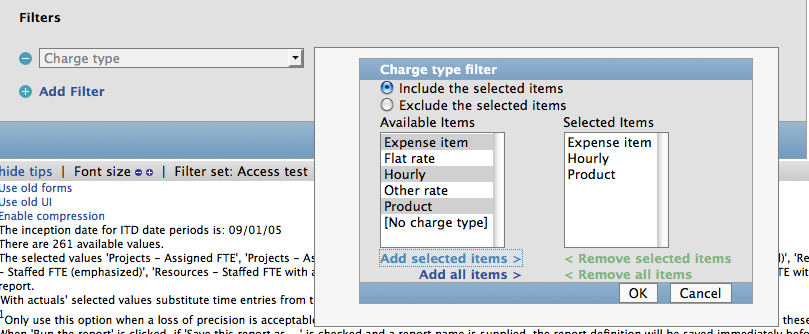

!SLIDE 
# jQuery Codeshare #
## Kevin Old ##
### @kevinold - kevin@kevinold.com ###

!SLIDE center

!SLIDE center

!SLIDE center

!SLIDE center

!SLIDE
## First, some structure (HTML) ##

    @@@ html
    <tr class="filter_row">
      <td>
        <a class="_remove_row">
        <select name="filter_dropdown_1">...

      <td>
        
...

      <td>
        
...

!SLIDE
## .closest(), .find() ##

    @@@ javaScript
    var row =
    jQuery(this).closest('.filter_row');

    row.find(':input[name^=filter_dropdown]');
    row.find('.filter_status');

!SLIDE
## .load() ##

    @@@ javaScript
    row.find('.panel_body').load(picker_url);

!SLIDE
## .live(), .die() ##

    @@@ javaScript
    jQuery('.row').live("click",
      function () { ... });

    jQuery('.row').die("click");

!SLIDE
## .data() ##

    @@@ javaScript
    panel.data('loaded', true).show();

    panel.data('loaded'); // true 

    panel.data(
      "info", { foo: 'bar', ping: 'pong'});
    panel.data("info").foo;  // bar

!SLIDE
## .is() ##

    @@@ javaScript
    jQuery('._remove_row').live("click",
      function (e) {
        e.preventDefault();
        var row =
        jQuery(this).closest('.filter_row');
        if (row.is(':first-child')) {
            // "reset" dropdown
            filter_opt.removeAttr('selected');
            // "reset" status
            filter_status.html('');
        } else {
            row.remove();
        }
    });

!SLIDE
# Thanks! #
